Flyby usage guide
=================

An introduction to satellite tracking and an earlier iteration of this guide
can be found at https://www.la1k.no/2017/03/03/satellite-tracking-using-flyby/.

Some minor descriptions (not part of original blog post) on [orbital schedules](#orbital-predictions) and [lunar
and solar passes](#solar-and-lunar-orbital-predictions) were inspired or copied from the original PREDICT manpage (author John A. Magliacane (KB2BD)), and could contain parts of sentences that correspond word by word to the original manpage.

See also [the glossary](glossary.md).

Table of Contents
=================

* [Note on Windows](#note-on-windows)
* [Building flyby and libpredict](#building-flyby-and-libpredict)
	* [Installation to system-wide paths](#installation-to-system-wide-paths)
	* [(Alternative) Local installation](#alternative-local-installation)
* [Running flyby for the first time](#running-flyby-for-the-first-time)
* [Obtaining and updating TLEs](#obtaining-and-updating-tles)
	* [Obtaining TLEs](#obtaining-tles)
	* [Updating TLEs](#updating-tles)
	* [Enabling TLEs](#enabling-tles)
* [Displaying satellite information](#displaying-satellite-information)
* [Defining transponders](#defining-transponders)
	* [Manual approach](#manual-approach)
	* [Automatic approach](#automatic-approach)
* [Enabling hamlib in flyby](#enabling-hamlib-in-flyby)
	* [Antenna adjustment](#antenna-adjustment)
	* [Rig frequency adjustment](#rig-frequency-adjustment)
* [Troubleshooting](#troubleshooting)


Note on Windows
---------------

Building and running flyby on Windows is theoretically possible by compiling
using mingw32 and linking against an appropriate curses library, or by using
Cygwin, but has to date not been tried by the authors. Use of GNU/Linux is
assumed, while other UNIX-based operating systems are probably supported,
though not tested to the authors' knowledge.

Building flyby and libpredict
-----------------------------

Flyby currently has no stable non-development version, and always depends
on the latest development version of libpredict. Libpredict has to be
compiled and installed from source before flyby can be compiled from source.

Dependencies for libpredict and flyby include CMake and a compiler, while flyby also requires ncurses. These are installed on a Debian-based system using e.g.
```
# apt-get install libncurses-dev cmake gcc make
```

### Installation to system-wide paths

libpredict is compiled and installed to system-wide paths using
```
$ git clone https://github.com/la1k/libpredict.git
$ mkdir libpredict/build; cd libpredict/build
$ cmake ..
$ make
(...)
# make install
# ldconfig
```
Similarly, for flyby:
```
$ git clone https://github.com/la1k/flyby.git
$ mkdir flyby/build; cd flyby/build
$ cmake ..
$ make
(optional: # make install)
```

### (Alternative) Local installation

It gets more messy and is not recommended, however, if you do not have access to installation to system-wide paths, or do not want to clutter up your system paths, libpredict can be installed locally for your user.

```
(Obtain libpredict and create and navigate to the build folder as outlined above)
$ LIBPREDICT_INSTALL_PREFIX=$HOME/.local
$ cmake -D CMAKE_INSTALL_PREFIX=$LIBPREDICT_INSTALL_PREFIX ..
$ make
$ make install
```
For flyby, link and include paths are changed as follows:
```
(Obtain flyby and create and navigate to build folder as outlined above)
$ cmake -D CMAKE_C_FLAGS="-L $LIBPREDICT_INSTALL_PREFIX/lib -I $LIBPREDICT_INSTALL_PREFIX/include" ..
$ make
```
You will likely encounter `./flyby: error while loading shared libraries:
libpredict.so.1: cannot open shared object file: No such file or directory`
when running flyby with a local libpredict. This is because libpredict
now is located in a non-standard path and `ld` cannot find the library. In this case, you can:

* Run e.g. `export LD_LIBRARY_PATH=$LIBPREDICT_INSTALL_PREFIX/lib` before running
flyby (or add this to your `.bashrc`-file)
* Run flyby using `LD_PRELOAD=$LIBPREDICT_INSTALL_PREFIX/lib/libpredict.so ./flyby`

If you get the same error when installing to system-wide paths, remember to run `ldconfig`, and otherwise check whether the default assumed install path in `cmake` actually is a part of your PATHs (should not be a problem on debian-derived systems).

Running flyby for the first time
--------------------------------

After a successful build, flyby can be run for the first time by navigating to the build directory and running `./flyby`.

In general, pressing the 'q' key will leave a screen and go back to the
previous screen, while the keyboard arrows are used for navigation. ENTER
usually means that something is accepted or entered, while space is used to mark items in a list.

Running flyby for the very first time will result in a screen similar to the following:

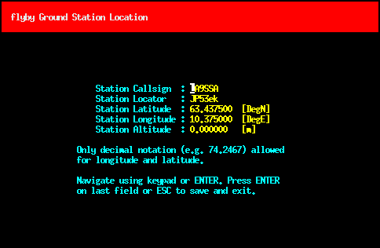

Here, you can input your coordinates so that flyby calculates correct satellite coordinates relative to your antenna. Station callsign is not used for much else than being printed in the multitrack view. You can enter whatever you want, your callsign, your dog's name, your mother's name. As an alternative to
inputting your coordinates, you can, if more known, input your locator. The coordinates will then be calculated from the center of the grid square.

Tip: After exiting the screen, flyby will generate a config file in `~/.config/flyby/flyby.qth`. Flyby normally defaults to empty callsign and zeroes for all coordinates, but if this file also is copied to `/etc/xdg/flyby/flyby.qth`, it will function as a default for new first time runs of the application. This can be convenient on a multi-user system where all users anyway would use the same set of coordinates.

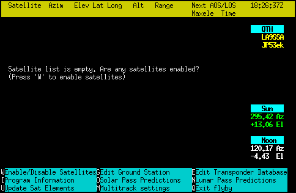

This is the screen that you will be greeted by when running flyby, and normally
displays all satellites that are enabled. As no satellites are enabled, it is
empty and suggests that you type 'w' to enter the menu for enabling satellites.

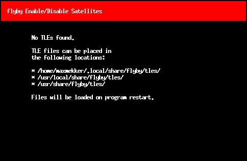

This is also empty, however, as no TLEs have been defined and flyby doesn't ship default TLEs. TLEs do therefore have to be downloaded. Next step: download TLEs.

Obtaining and updating TLEs
---------------------------

### Obtaining TLEs

TLEs can be found at [celestrak.com](http://www.celestrak.com/NORAD/elements/) and [amsat.org](http://www.amsat.org/amsat-new/tools/keps.php).

In flyby, TLE files that are placed in:

* `$XDG_DATA_HOME/flyby/tles` (in practice: `$HOME/.local/share/flyby/tles`)
* `$XDG_DATA_DIRS/flyby/tles` (in practice: `/usr/local/share/flyby/tles` and `/usr/share/flyby/tles`)

will all be loaded into the program. User-defined TLEs take precedence over system-defined TLEs regardless of TLE epoch, and TLEs with more recent epochs take precedence over older TLEs within the same folder.

A TLE file containing all amateur radio-related satellites can be added using

```
wget http://www.celestrak.com/NORAD/elements/amateur.txt -P /tmp/
./flyby --add-tle-file /tmp/amateur.txt
```
or directly:

```
wget http://www.celestrak.com/NORAD/elements/amateur.txt -P ~/.local/share/flyby/tles/
```
Both approaches will yield the same end result.

### Updating TLEs

As a set of parameters to a perturbation model
around a time _t0_, TLEs have a limited numerical validity far
from the start time. They therefore have to be updated regularly in order to
obtain accurate predictions.

The script `flyby-update-tles` (located in the `build/`-folder after compilation) updates flyby's TLEs based on the current version of `amateur.txt`, `visual.txt`, `weather.txt`, `cubesat.txt`, `science.txt` and `engineering.txt` from celestrak.com. Be aware that this only updates TLEs that already are present in the database. Any new entries in the text files are ignored. If new entries are desired, the file has to be re-added using the approach outlined above.

### Enabling TLEs

Running flyby again and navigating to the 'W' submenu will result in this screen:

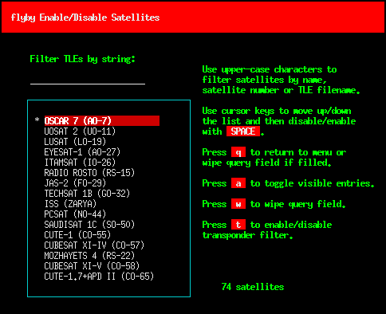

The default is that no satellites are enabled for display. We have to enable satellites.

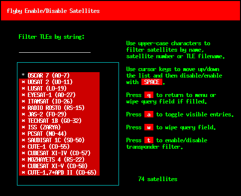

We can enable all satellites in the database by typing 'a'. Alternatively, more advanced selection can either be done manually or by entering a search term with CAPITAL LETTERS and selecting or deselecting either manually or using 'a'. The search term will match the satellite number, the satellite name or the filename of the containing TLE file.

Displaying satellite information
--------------------------------

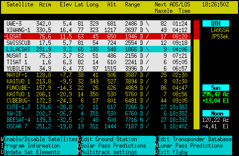

Back in the multitrack view, this now shows a color-coded overview over all the enabled satellites. On the top, with colored backgrounds, are the satellites that currently are passing over our horizon. The times shown to the right are the minutes and seconds until the satellites finish their passes. The rest of the satellites are sorted by the time left until the next time they pass over our horizon, either displayed with the number of minutes until AOS or the absolute UTC time if too far away. At the bottom (use page down or hold in your down arrow button) you will find satellites that never will pass over your horizon.

The letters 'D', 'N' or 'V' after the slant range indicate, respectively, that the satellite is in sunlight but not visible, the satellite is in eclipse and that the satellite is in sunlight and visible. The symbols '/', '=' and '\' indicate the direction the satellite is moving with respect to the observer.

Pressing 'F1' can be used to display a help window.

The listing sorts satellites above the horizon according to the max elevation during the pass, while satellites below the horizon are sorted according to the time until the next pass. By pressing 'M' and selecting "Sort by max elevation", all satellites can be sorted by their maximum elevations.

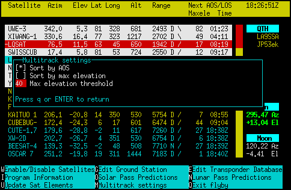

Passes can also be filtered by entering a max elevation threshold: Here, 40 means that all upcoming or current passes with max elevation below 40 degrees will be put at the bottom of the list.

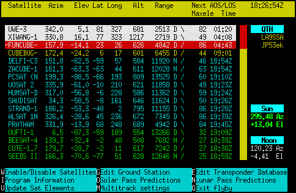

This functionality enables the user to focus only on higher quality passes, as defined by the user.

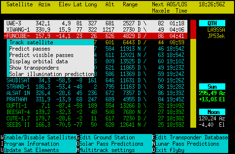

We will try out the single track mode. Press either right arrow button or ENTER and select 'Track satellite'.

(Tip: 'T' enters single track mode directly, like for the main menu in original predict.)

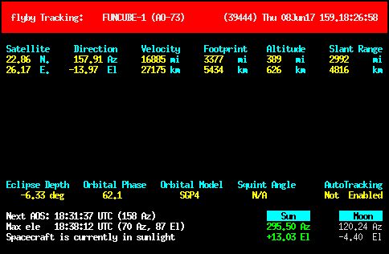

Now, a screen is shown containing almost exactly the same information as in the previous multitrack view. Here, however, some additional features are available for controlling antenna rotors and radio rigs.

### Orbital predictions

(This subsection is based on PREDICT's original manpage.)

In the previous menu, selecting 'Predict passes' (or pressing P) or 'Predict visible
passes' (or pressing V) would, respectively, show tables over the upcoming passes or
upcoming visible passes. This can be be convenient for planning in
advance any observations, or confirming past observations. In both cases, symbol '\*' to the right means that the satellite is in sunlight, while '+' means that the satellite is in sunlight and in the cover of darkness. Under good viewing conditions and for large satellites like ISS, the latter means that the satellite is visible to the naked eye.

Selecting 'Solar illumination prediction' will show tables over how much sunlight a particular satellite wil receive during a 24 hour period.

### Solar and lunar orbital predictions

(This subsection is based on PREDICT's original manpage.)

Selecting 'O' or 'N' in the main menu will display orbital schedules for the Sun and the Moon, respectively. Here, declination (Dec) and the greenwich hour angle (GHA) correspond to the latitude and longitude of the object's sub-satellite point above the Earth's surface. RA is the right ascension. Range corresponds to the normalized distance to the object (actual distance divided by the average distance).
In practice,
the normalized distance can range from about 0.945 to 1.055 for
the Moon, and about 0.983 to 1.017 for the Sun.

The radial velocity (Vel) corresponds to
the speed and direction the object is traveling toward (+) or away
(-) from the ground station, and is expressed in meters per second.
When the radial distance of the Moon is close to zero, the amount of
Doppler shift experienced in Moonbounce communications is minimal.

Note that the effects of atmospherics are ignored in determining the
elevation angles for the Sun and Moon. Furthermore, the data
provided by flyby corresponds to the object's center, and
not the upper or lower limb, as is sometimes done when predicting
the rising and setting times of these celestial objects.

Defining transponders
---------------------

Satellite transponders can be defined for doppler shift calculations
and automatic radio frequency adjustment in singletrack mode.

### Manual approach

Flyby has a transponder editor interface which can be used for manual transponder definition.

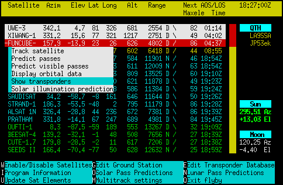

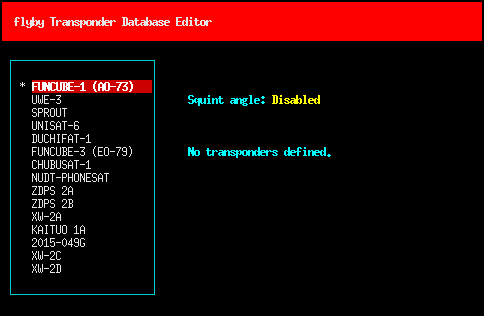

We arrive in the transponder database editor (also accessible from the main menu by pressing 'E'). We have no transponders defined. We now define transponders.


Information that can be found on the Internet is typed into the fields (typically search for satellite name + transponder, or beacon). The two fields for uplink and downlink, respectively, indicate start and end of a frequency range. One of them can be left blank.

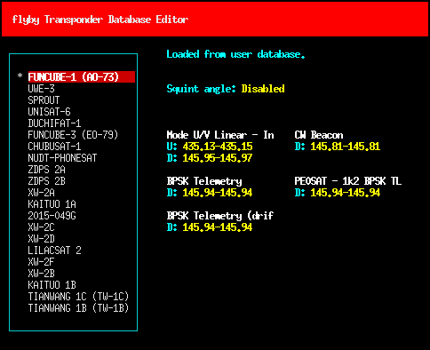

### Automatic approach

Transponder entries can also be fetched directly from the [SatNOGS database](https://db.satnogs.org/).

Running plain `flyby-satnogs-fetcher` (located in the `build/`-folder after compilation) will fetch the database, convert the entries, try to merge with the local database and ask whether entries should be merged or ignored if there is a conflict.

Alternatively, for more options like silent mode, forcing all changes or similar, the following can be used:

```
./flyby-satnogs-fetcher /tmp/temp-transponder-db
./flyby-transponder-dbutil --add-transponder-file /tmp/temp-transponder-db --silent --force-changes
```

(See also `./flyby-transponder-dbutil --help` for more options.)

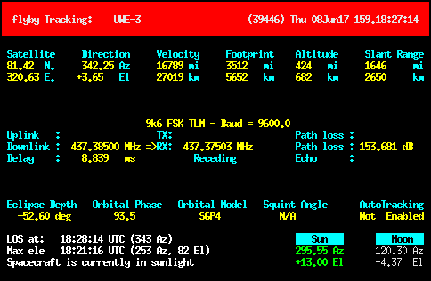

Going back to the single track mode, more information on the transponders and their current, doppler-shifted frequencies are now available. This information can be powerful when automatic antenna and radio tracking are enabled.

Enabling hamlib in flyby
------------------------

Flyby is hamlib-enabled though a socket against rotctld and rigctld. Flyby can separatedly control a downlink and uplink VFO of a rigctld-controlled rig, and
adjust the antenna directions of a rotctld-controlled antenna rotor. To demonstrate this, rotctld and rigctld sessions will be started using dummy devices by applying these commands on two separate terminals:
```
rotctld -m 1 -vvvvvv 
rigctld -m 1 -vvvvvv
```
The verbose output of each command can be followed to verify that the dummy antenna is rotated and that the dummy rig has its frequency changed. In a production situation, the number 1 would be replaced by the corresponding model numbers of your rig or antenna. For example, for an IC9100 rig and a SPID rotor controller, this would typically be `rotctld -m 901 -r /dev/ttyS0 -C az_resolution=2 -C el_resolution=2` and `rigctld -m 368 -r /dev/ttyUSB0`.

### Antenna adjustment

To enable rotctld support, flyby is restarted using
```
flyby --rotctld-tracking
```
Host and/or port can be defined using `--rotctld-tracking=HOST` or `--rotctld-tracking=HOST:PORT`.

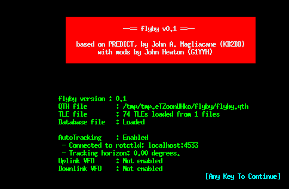

In the main menu, 'i' can be typed to show the screen above, which verifies whether flyby has connected to rotctld. When flyby was started, a number could have been defined for `--tracking-horizon`. This can be useful for automatically making flyby start tracking the satellite and prepare the rotor array in the correct direction in advance of the actual AOS of the satellite. This is the "Tracking horizon" shown above. Alternatively, in singletrack mode, pressing 'A' can also be used to manually rotate the antenna towards the AOS azimuth position regardless of the artificial horizon option.

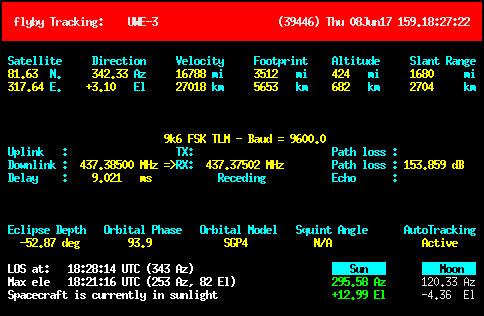

We can also notice that "Autotracking disabled" has now changed to, in this case, "Active" in single track mode. If the satellite had been below the horizon, it would have shown the text "Standing by". The output of rotctld should now show position changes as the satellite is passing over the horizon.

Antenna adjustment will be activated regardless of whether any transponders are defined or not.

### Rig frequency adjustment

If flyby is restarted using
```
flyby --rotctld-tracking --rigctld-downlink
```
it should be possible to see that the frequency in rigctl also is changing according to the calculated doppler shift of the transponder. Some keyboard shortcuts for frequency operation are available in single track mode:

* Key left/key right or +/- key switches the tracked satellite
* Space switches between the transponders
* Key down/key up/\</\>/,/. further shifts the doppler-shifted uplink/downlink frequencies
* d/D and u/U turns on/off downlink/uplink updates (f turns on both)
* F reads frequency once from rigctl
* m/M turns on/off automatic frequency reading from rigctl
* x reverses VFO of downlink/uplink

These are also displayed by pressing 'h' in singletrack mode.

More options for rotctld and rigctld operation can be reviewed using
```
flyby --help
```
A uplink VFO can e.g. be added using `--rigctld-uplink`.

Troubleshooting
---------------

### flyby freezes on "Preparing entry 53 of 344" (or similar)

This is probably due to a bug in `predict_is_geostationary()` in libpredict (see https://github.com/la1k/libpredict/issues/66).
The AOS/LOS finding functions in libpredict use `predict_is_geostationary()` to
avoid trying to look for AOS/LOS of geostationary satellites, but
`predict_is_geostationary()` does not classify all geosynchronous orbits correctly (uses a too strict definition).
Combine that with missing limits on the number of iterations in the AOS/LOS
functions, and more challenging use of AOS/LOS functions in `predict_at_max_elevation()`, and the result is that misclassified geosynchronous satellites lead to unending iteration loops.

This is fixed in https://github.com/la1k/libpredict/pull/72. Until this is merged, and you encounter this bug, you can disable the offending satellites by:

* Editing `$HOME/.config/flyby/flyby.whitelist` and removing the satellite numbers corresponding to your geostationary satellites
* Removing `$HOME/.config/flyby/flyby.whitelist` altogether and be careful about which satellites you enable again

### flyby doesn't compile, fails with "warning: implicit declaration of function 'predict(...)", "warning: passing argument 1 of 'predict(...)", "error: too many arguments to function 'predict(...)", or similar

Since the offending function is prefixed by `predict_`, this is a libpredict function, and since the compiler warnings and errors are all about unexpected functions, arguments or similar, it most likely means that you don't have the latest version of libpredict installed, or that your compiler is trying to include or link against the wrong version.

In your libpredict folder, you can obtain the latest version by running `git pull`, and recompile and reinstall as according to the instructions [in the beginning of this guide](#building-flyby-and-libpredict).
